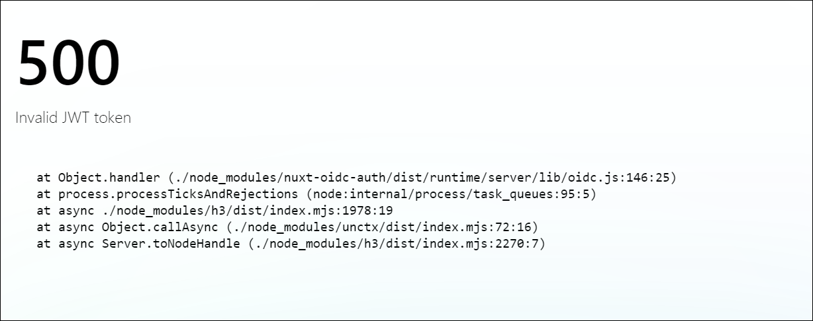

# nuxt-oidc-auth-test

## Description

This repository is for testing the integration between the nuxt-oidc-auth module and Auth0.

As of v0.18.0 (2024-10-27), we believe that integrating with an Auth0 application results in an `Invalid JWT token` error during the processing of the response from Auth0's OAuth Token Endpoint (/oauth/token).

This repository includes the minimal content to confirm this issue.



Console Error:

```
[nuxt] [request error] [unhandled] [500] Invalid JWT token
  at parseJwtToken (./node_modules/nuxt-oidc-auth/dist/runtime/server/utils/security.js:71:11)
  at Object.handler (./node_modules/nuxt-oidc-auth/dist/runtime/server/lib/oidc.js:146:25)
  at process.processTicksAndRejections (node:internal/process/task_queues:95:5)
  at async ./node_modules/h3/dist/index.mjs:1978:19
  at async Object.callAsync (./node_modules/unctx/dist/index.mjs:72:16)
  at async Server.toNodeHandle (./node_modules/h3/dist/index.mjs:2270:7)
```

## Setup

Make sure to install dependencies:

```bash
# npm
yarn install
```

## Development Server

Start the development server on `http://localhost:3000`:

```bash
yarn dev
```
